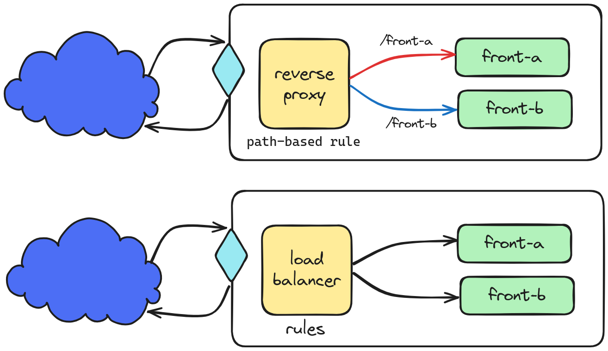

## Basic examples of load balancer and reverse proxy configuration

### Load Balancer x Reverse Proxy

A reverse proxy accepts a request from a client, forwards it to a server that can fulfill it, and returns the server's response to the client. A load balancer distributes incoming client requests among a group of servers, in each case returning the response from the selected server to the appropriate client.



`Preferably test using curl instead browser`

#### Caddy

load balancer
```sh
make up service=caddy_load_balancer
curl http://localhost/ # test
make down service=caddy_load_balancer
```

reverse proxy
```sh
make up service=caddy_reverse_proxy
curl http://localhost/front-a # test
curl http://localhost/front-b # test
make down service=caddy_reverse_proxy
```

#### Envoy

load balancer
```sh
make up service=envoy_load_balancer
curl http://localhost:8888/ # test
make down service=envoy_load_balancer
```

reverse proxy
```sh
make up service=envoy_reverse_proxy
curl http://localhost:8888/front-a # test
curl http://localhost:8888/front-b # test
make down service=envoy_reverse_proxy
```

#### HAProxy

load balancer
```sh
make up service=haproxy_load_balancer
curl http://localhost/ # test
make down service=haproxy_load_balancer
```

reverse proxy
```sh
make up service=haproxy_reverse_proxy
curl http://localhost/front-a # test
curl http://localhost/front-b # test
make down service=haproxy_reverse_proxy
```

#### Nginx

load balancer
```sh
make up service=nginx_load_balancer
curl http://localhost/ # test
make down service=nginx_load_balancer
```

reverse proxy
```sh
make up service=nginx_reverse_proxy
curl http://localhost/front-a # test
curl http://localhost/front-b # test
make down service=nginx_reverse_proxy
```

#### Traefik

load balancer
```sh
make up service=traefik_load_balancer
curl http://localhost/ # test
make down service=traefik_load_balancer
```

reverse proxy
```sh
make up service=traefik_reverse_proxy
curl http://localhost/front-a # test
curl http://localhost/front-b # test
make down service=traefik_reverse_proxy
```