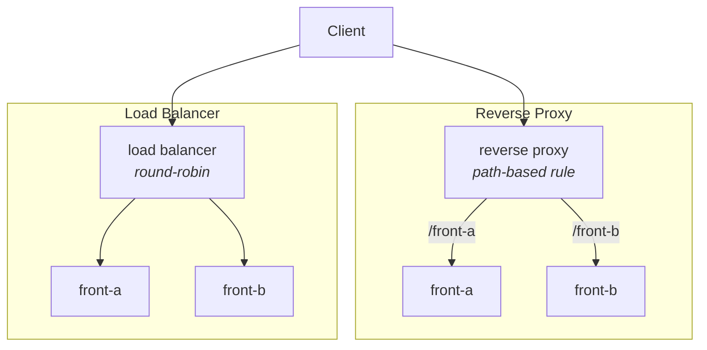

## Exploring alternatives for load balancing and reverse proxy

### Objectives

The purpose of this PoC is to simply test and compare the basic configurations of different tools used as reverse proxies and load balancers. A reverse proxy receives client requests and forwards them to internal servers, handling tasks such as SSL termination, content caching, and request routing. A load balancer distributes traffic across multiple servers to optimize performance and ensure high availability. The tools evaluated include **Caddy, Envoy, HAProxy, Nginx, and Traefik**. The goal is not to analyze performance or advanced use cases but rather to explore their basic configurations for both purposes, making it easier to choose the most suitable solution based on ease of use and available features.

### Prerequisites

- make
- docker
- docker compose

### Load Balancer and Reverse Proxy

In the dynamic landscape of web infrastructure, Reverse Proxies and Load Balancers play pivotal roles in optimizing performance, ensuring scalability, and enhancing security. These two components often work hand in hand, complementing each other to deliver a seamless and efficient user experience.

A Reverse Proxy, at its core, acts as an intermediary between client devices and web servers. Unlike a traditional forward proxy, which handles requests on behalf of clients, a reverse proxy manages server-side requests. It accepts incoming client requests and forwards them to the appropriate server, concealing the identity and characteristics of the backend servers from external users. This not only provides an additional layer of security but also enables the implementation of various optimizations, such as SSL termination and content caching, to improve overall website performance.

On the other hand, a Load Balancer is designed to distribute incoming network traffic across multiple servers, ensuring no single server is overwhelmed with requests. This distribution of traffic helps prevent server overloads, reduces response times, and enhances the reliability and availability of web applications. Load Balancers can operate at different layers of the OSI model, directing traffic based on factors like server health, response times, or using predefined algorithms.

**Load Balancing Algorithms:**
- Round-robin (default in most)
- Least connections
- IP hash (session affinity)
  



The relationship between a Reverse Proxy and a Load Balancer is symbiotic. In many scenarios, a Reverse Proxy is deployed in conjunction with a Load Balancer to create a robust and scalable infrastructure. The Reverse Proxy handles tasks such as SSL termination, caching, and compression, offloading these responsibilities from the backend servers. Meanwhile, the Load Balancer distributes incoming requests among multiple servers, optimizing resource utilization and ensuring high availability.

#### Common Proxy & Load Balancer features

- SSL/TLS Termination
- Basic Authentication
- Certificate Management
- IP Forwarding
- Path-based Routing
- Host-based Routing
- Session Persistence
- Health Checks
- Load Distribution
- Caching
- Compression
- Security Filtering
- WebSocket Support
- Logging / Metrics
- Failover / Redundancy

### Reproducing

#### Caddy

load balancer
```sh
make up service=caddy_load_balancer
curl http://localhost/ # test
make down service=caddy_load_balancer
```

reverse proxy
```sh
make up service=caddy_reverse_proxy
curl http://localhost/front-a # test
curl http://localhost/front-b # test
make down service=caddy_reverse_proxy
```

#### Envoy

load balancer
```sh
make up service=envoy_load_balancer
curl http://localhost:8888/ # test
make down service=envoy_load_balancer
```

reverse proxy
```sh
make up service=envoy_reverse_proxy
curl http://localhost:8888/front-a # test
curl http://localhost:8888/front-b # test
make down service=envoy_reverse_proxy
```

#### HAProxy

load balancer
```sh
make up service=haproxy_load_balancer
curl http://localhost/ # test
make down service=haproxy_load_balancer
```

reverse proxy
```sh
make up service=haproxy_reverse_proxy
curl http://localhost/front-a # test
curl http://localhost/front-b # test
make down service=haproxy_reverse_proxy
```

#### Nginx

load balancer
```sh
make up service=nginx_load_balancer
curl http://localhost/ # test
make down service=nginx_load_balancer
```

reverse proxy
```sh
make up service=nginx_reverse_proxy
curl http://localhost/front-a # test
curl http://localhost/front-b # test
make down service=nginx_reverse_proxy
```

#### Traefik

load balancer
```sh
make up service=traefik_load_balancer
curl http://localhost/ # test
make down service=traefik_load_balancer
```

reverse proxy
```sh
make up service=traefik_reverse_proxy
curl http://localhost/front-a # test
curl http://localhost/front-b # test
make down service=traefik_reverse_proxy
```

`FYI: Preferably test using curl instead browser`

### Results

When it comes to setting up load balancers and reverse proxies, there are a lot of ways to go about it, and each tool has its own quirks and strengths. Some options, like Caddy, Envoy, and Traefik, give you the freedom to choose from a variety of configuration file formats, such as YAML, TOML, and more. This makes it easier to pick the one that suits your style or fits better with your infrastructure.On the flip side, tools like HAProxy and Nginx stick to their own formats and configurations, which might take a little more getting used to. They may feel a bit more rigid, but they make up for it with power and reliability, often becoming the go-to choices for certain situations. At the end of the day, choosing the right tool comes down to factors like ease of use, flexibility, and your specific performance needs. Understanding what each tool does best and how it likes to be configured helps you make the right call for building a scalable and efficient web infrastructure.

### References

```
🔗 https://docs.nginx.com/nginx/admin-guide/load-balancer/http-load-balancer/
🔗 https://medium.com/@mahernaija/new-2025-how-to-configure-mutual-tls-mtls-for-secure-nginx-206f983ba571
🔗 https://rafaeldalsenter.medium.com/docker-compose-nginx-aplica%C3%A7%C3%A3o-web-banco-de-dados-d8f6f33adfd2
🔗 https://dev.to/a8hok/reverse-proxy-using-varnish-b27
🔗 https://docs.vultr.com/set-up-traefik-proxy-as-a-reverse-proxy-for-docker-containers-on-ubuntu-24-04
🔗 https://medium.com/@anbu.gn/getting-started-with-envoy-reverse-proxy-a-basic-guide-b7e011ad2f78
🔗 https://medium.com/@yahyasghiouri1998/building-a-high-availability-cluster-with-haproxy-keepalived-and-docker-a-step-by-step-guide-9325f4ac8aa7
🔗 https://caddyserver.com/docs/caddyfile/directives/reverse_proxy
```