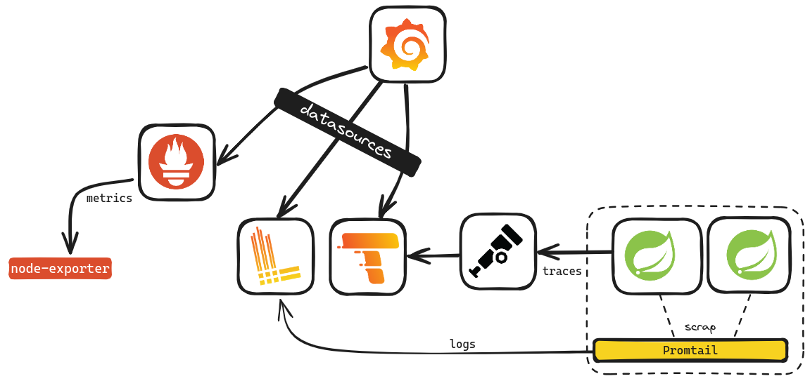
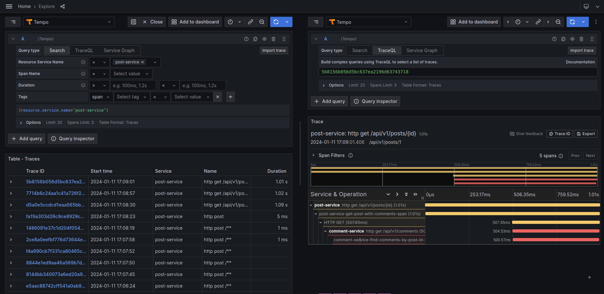

## Modern Monitoring Stack

The OpenTelemetry Collector is a crucial component within the OpenTelemetry project, aiming to standardize software instrumentation for enhanced observability in distributed systems. This collector functions as an intermediary, responsible for gathering instrumentation data generated by libraries, agents, or manual instrumentation in applications.

| Tool | Description | 
|----------|----------|
| Grafana | Grafana is the open source analytics & monitoring solution for every database |
| Grafana Loki | Loki is a horizontally scalable, highly available, multi-tenant log aggregation system inspired by Prometheus |
| Grafana Tempo | Grafana Tempo is an open source, easy-to-use, and high-scale distributed tracing backend |
| Promtail | Promtail is an agent which ships the contents of local logs to a private |
| Prometheus | Power your metrics and alerting with the leading |open-source monitoring solution |
| Node exporter | The node_exporter is designed to monitor the host system |
| OpenTelemetry Collector | The OpenTelemetry Collector offers a vendor-agnostic implementation of how to receive, process and export telemetry data |
| Spring Application | Spring Boot helps you accelerate application development |

 

```
docker compose up -d
cd apps/comment-service && mvn spring-boot:run
cd apps/comment-service && mvn spring-boot:run
curl http://localhost:8080/api/v1/posts/1
```

**Grafana**: http://localhost:3000 

 

*Use the explore area to view statistics, traces and logs*