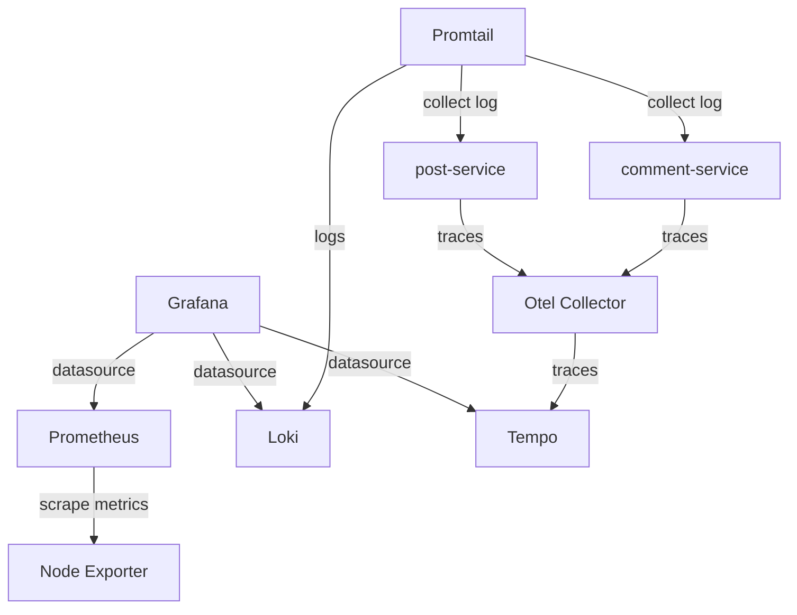

## Modern Monitoring Stack (logs, traces and metrics)

### Objectives

This lab aims to test and integrate key observability tools including Prometheus for metrics collection, Grafana for visualization, Node Exporter for system metrics, OpenTelemetry Collector for telemetry data processing, Tempo for distributed tracing, Loki for log aggregation, and Promtail for log forwarding. All components are containerized using Docker Compose and connected through a shared monitoring network, creating a unified platform for monitoring, logging, and tracing in modern cloud-native environments.

| Tool                                | Description                                                                                                              | Port |
| ----------------------------------- | ------------------------------------------------------------------------------------------------------------------------ | ---- |
| Grafana                             | Grafana is the open source analytics & monitoring solution for every database                                            | 3000 |
| Grafana Loki                        | Loki is a horizontally scalable, highly available, multi-tenant log aggregation system inspired by Prometheus            | 3100 |
| Grafana Tempo                       | Grafana Tempo is an open source, easy-to-use, and high-scale distributed tracing backend                                 | 3200 |
| Promtail                            | Promtail is an agent which ships the contents of local logs to a private                                                 | 9080 |
| Prometheus                          | Power your metrics and alerting with the leading open-source monitoring solution                                         | 9090 |
| Node exporter                       | The node_exporter is designed to monitor the host system                                                                 | 9100 |
| OpenTelemetry Collector             | The OpenTelemetry Collector offers a vendor-agnostic implementation of how to receive, process and export telemetry data | 4317 |
| Spring Application(comment-service) | Java Spring application that sends traces to otel collector via HTTP on 4318 development                                                                 | 8082 |
| Spring Application(post-service)    | Java Spring application that sends traces to otel collector via HTTP on 4318 development                                                                 | 8080 |




### Prerequisites

- make
- docker
- docker-compose
- java
- maven/spring-boot
  
### Reproducing

up docker compose services
```
docker compose up -d
cd apps/comment-service && mvn spring-boot:run
cd apps/comment-service && mvn spring-boot:run
```

testing application using curl
```
curl http://localhost:8080/api/v1/posts/1
```

to collect logs add in compose service
```
labels:
    - logging=promtail
```

**Grafana**: http://localhost:3000 

### Results

The lab successfully demonstrated the integration of observability tools, with metrics, logs, and traces working seamlessly together. OpenTelemetry Collector proved to be the key component, acting as a flexible bridge between systems and enabling smooth data flow across the entire stack.

 

### References