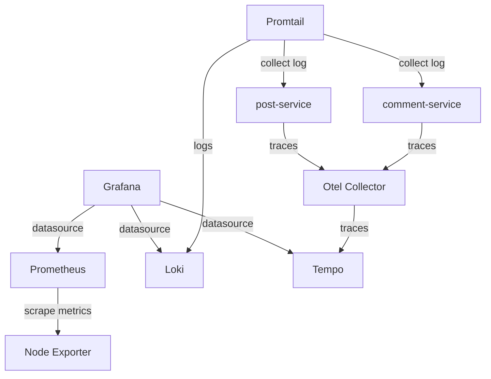

## Building a modern observability platform using Prometheus, Grafana, Tempo and OpenTelemetry

### Objectives

This lab aims to test and integrate key observability tools including Prometheus for metrics collection, Grafana for visualization, Node Exporter for system metrics, OpenTelemetry Collector for telemetry data processing, Tempo for distributed tracing, Loki for log aggregation, and Promtail for log forwarding. All components are containerized using Docker Compose and connected through a shared monitoring network, creating a unified platform for monitoring, logging, and tracing in modern cloud-native environments.

| Tool                                | Description                                                                                                              | Port |
| ----------------------------------- | ------------------------------------------------------------------------------------------------------------------------ | ---- |
| Grafana                             | Grafana is the open source analytics & monitoring solution for every database                                            | 3000 |
| Grafana Loki                        | Loki is a horizontally scalable, highly available, multi-tenant log aggregation system inspired by Prometheus            | 3100 |
| Grafana Tempo                       | Grafana Tempo is an open source, easy-to-use, and high-scale distributed tracing backend                                 | 3200 |
| Promtail                            | Promtail is an agent which ships the contents of local logs to a private                                                 | 9080 |
| Prometheus                          | Power your metrics and alerting with the leading open-source monitoring solution                                         | 9090 |
| Node exporter                       | The node_exporter is designed to monitor the host system                                                                 | 9100 |
| OpenTelemetry Collector             | The OpenTelemetry Collector offers a vendor-agnostic implementation of how to receive, process and export telemetry data | 4317 |
| Spring Application(comment-service) | Java Spring application that sends traces to otel collector via HTTP on 4318 development                                 | 8082 |
| Spring Application(post-service)    | Java Spring application that sends traces to otel collector via HTTP on 4318 development                                 | 8086 |




### Prerequisites

- make
- docker
- docker compose
- java
- maven/spring-boot
- mise(*optional*)
  
### Reproducing

Up docker compose services and java applications
```bash
docker compose up --build
```

Testing application using curl
```bash
curl http://localhost:8086/api/v1/posts/1
for ((;;)); do curl http://localhost:8086/api/v1/posts/1 ;done
```

*output*:
```json
{"id":1,"title":"What is the Zipkin?","content":"Nice tool","comments":[{"id":1,"content":"nice post 1","postId":1},{"id":2,"content":"nice post 2","postId":1},{"id":3,"content":"nice post 3","postId":1}]}
```

### FYI

To collect logs add in compose service
```
labels:
    - logging=promtail
```

### Install java/maven using [mise](https://mise.jdx.dev/lang/java.html)
```bash
mise use -g java@17
mise install maven
mise use maven
```

Run Java applications without Docker container
```bash
cd apps/comment-service && mvn spring-boot:run
cd apps/comment-service && mvn spring-boot:run
```

### Results

**Grafana**: http://localhost:3000 

The lab successfully demonstrated the integration of observability tools, with metrics, logs, and traces working seamlessly together. OpenTelemetry Collector proved to be the key component, acting as a flexible bridge between systems and enabling smooth data flow across the entire stack.

 


### References

```
🔗 https://start.spring.io/
🔗 https://docs.micrometer.io/micrometer/reference/implementations/otlp.html
🔗 https://opentelemetry.io/docs/zero-code/java/spring-boot-starter/
🔗 https://opentelemetry.io/docs/languages/java/instrumentation/
🔗 https://opentelemetry.io/docs/languages/java/
🔗 https://github.com/open-telemetry/opentelemetry-java-instrumentation
🔗 https://last9.io/blog/opentelemetry-java-agent/
🔗 https://medium.com/@RafaelDurelli/end-to-end-observability-with-kubernetes-prometheus-grafana-plus-a-spring-boot-bonus-6e97f220da14
🔗 https://github.com/open-telemetry/opentelemetry-collector/releases/tag/v0.133.0
🔗 https://grafana.com/grafana/dashboards/20352-opentelemetry-jvm-micrometer/
🔗 https://github.com/marcingrzejszczak/observability-boot-blog-post/blob/main/server/src/main/resources/application.properties
```