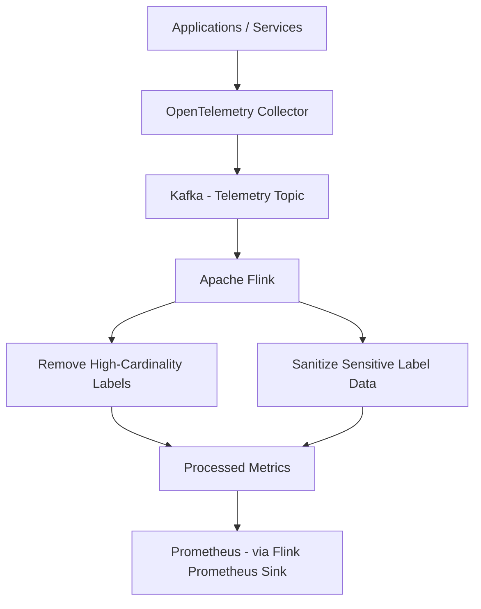

# Processing observability data at scale with Apache Flink

### Objectives

The goal of this PoC is to build an environment where telemetry data is ingested by a lightweight OpenTelemetry Collector, which acts purely as a forwarder, sending metrics to Kafka without any advanced processing logic. Instead, the processing will be handled by Apache Flink, a tool designed specifically for stream data processing. This PoC will focus solely on metric data. The final goal is to forward the processed metrics to Prometheus using Flink's Prometheus Sink connector. The Flink processing pipeline will focus on two main objectives:

1. Remove high-cardinality labels

2. Sanitize sensitive data that may appear in labels



### Prerequisites

- flink-2.1.0
- docker [*Docker version 28.3.3*]
- docker compose
- python [*Python 3.12.3*]
- java [*openjdk 21.0.8*]

### Reproducing


```
docker compose up -d
```

docker exec -it loganomalies-flink-jobmanager-1 bash
ps aux | grep flink
./bin/flink run -py jobs/word_count.py
./bin/flink run -py jobs/anomaly_job.py
docker compose down --remove-orphans
flink run -c com.example.HighCardinalityJob target/<file.jar>

for i in $(seq 1 100); do
  echo "user_event_total2{user_id=\"user_$((RANDOM % 10000))\", session_id=\"sess_$(uuidgen)\"} 1"
done | kafka-console-producer --topic raw-logs --bootstrap-server kafka:29092

kafka-console-producer \
  --topic raw-logs \
  --bootstrap-server kafka:29092 < sample.txt

docker compose down --remove-orphans

for i in $(seq 1 100); do
  echo "user_event_total2{user_id=\"user_$((RANDOM % 10000))\", session_id=\"sess_$(uuidgen)\"} 1"
done | kafka-console-producer --topic raw-logs --bootstrap-server kafka:29092


http://localhost:8080/
http://localhost:5050/browser/


kafka-console-producer \
  --topic raw-logs \
  --bootstrap-server kafka:29092 < sample.txt


mvn clean package
flink run -c com.example.HighCardinalityJob target/high-cardinality-detector-1.0-SNAPSHOT.jar


### Results


### References
🔗


https://grafana.com/blog/2022/10/20/how-to-manage-high-cardinality-metrics-in-prometheus-and-kubernetes/
https://medium.com/@platform.engineers/optimizing-prometheus-storage-handling-high-cardinality-metrics-at-scale-31140c92a7e4
https://last9.io/blog/how-to-manage-high-cardinality-metrics-in-prometheus/
https://grafana.com/blog/2022/12/02/monitoring-high-cardinality-jobs-with-grafana-grafana-loki-and-prometheus/
https://data-mozart.com/cardinality-your-majesty/


Flink
https://aws.amazon.com/pt/blogs/big-data/process-millions-of-observability-events-with-apache-flink-and-write-directly-to-prometheus/
https://mateus-oliveira.medium.com/produzindo-dados-no-apache-kafka-com-python-d072b6aae298
https://dalelane.co.uk/blog/?p=5483
https://blog.devops.dev/unlock-the-power-of-flink-metrics-with-prometheus-and-grafana-docker-compose-example-30d904f996e5
https://current.confluent.io/post-conference-videos-2025/flink-kafka-and-prometheus-better-together-to-improve-efficiency-of-your-observability-platform-lnd25
https://risingwave.com/blog/flink-and-prometheus-cloud-native-monitoring-of-streaming-applications/
https://fosdem.org/2025/schedule/event/fosdem-2025-5726-apache-flink-and-prometheus-better-together-to-improve-the-efficiency-of-your-observability-platform-at-scale/
https://fosdem.org/2025/events/attachments/fosdem-2025-5726-apache-flink-and-prometheus-better-together-to-improve-the-efficiency-of-your-observability-platform-at-scale/slides/238397/FOSDEM_-_9RvAzEV.pdf
https://nightlies.apache.org/flink/flink-docs-master/docs/concepts/overview/
https://nightlies.apache.org/flink/flink-docs-master/docs/deployment/overview/#session-mode
https://www.youtube.com/watch?v=v3rnbzLXwx8

https://github.com/vuanhtuan1407/LogAnomalies.git

https://www.youtube.com/watch?v=trhsC9tcGU4
https://nightlies.apache.org/flink/flink-docs-master/
https://prometheus.io/docs/specs/prw/remote_write_spec/