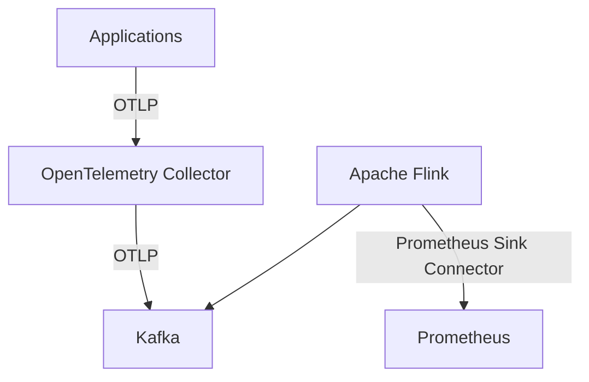

# Processing observability data at scale with Apache Flink

### Objectives

The goal of this PoC is to build an environment where telemetry data is ingested by a lightweight OpenTelemetry Collector, which acts solely as a forwarder, sending metrics to Kafka without any advanced processing logic. Instead, processing will be performed by Apache Flink, a tool specifically designed for stream data processing. This PoC will focus exclusively on metrics data. The ultimate goal is to forward the processed metrics to Prometheus using Flink's Prometheus Sink connector.

⚠️ This PoC has nothing to do with advanced processing in Flink, this will be covered in another PoC focused on techniques for dealing with high cardinality, data aggregation, and the use of machine learning/statistics.

#### Ideas

1. Remove high-cardinality labels

```
order_payment_failures_total{order_id="a3f5d12c-0b2a-4dc7-83e5-9f72c3a421df", env="prod", region="us-east"} 1
order_payment_failures_total{order_id="91df21e1-1870-4d94-bd07-7fa6d6c7f1df", env="prod", region="us-east"} 1
order_payment_failures_total{order_id="77a8d92c-b302-4d6b-80e7-2f42b920dd24", env="prod", region="us-east"} 1
order_payment_failures_total{order_id="4a9b0d2a-50f2-4c64-9398-1a5e842f82b2", env="prod", region="us-east"} 1
order_payment_failures_total{order_id="6dfb91b2-39b1-47ab-a0ad-0a8b1b4e94c8", env="prod", region="us-east"} 1
```

```
process_cpu_percent{pid="48291", env="prod", region="us-east"} 15.3
process_cpu_percent{pid="48292", env="prod", region="us-east"} 12.1
process_cpu_percent{pid="48293", env="prod", region="us-east"} 18.7
process_cpu_percent{pid="48294", env="prod", region="us-east"} 10.2
process_cpu_percent{pid="48295", env="prod", region="us-east"} 22.5
```

```
temp_file_size_bytes{file_path="/tmp/upload/session_1691831294000/file.txt", env="prod", region="us-east"} 18432
temp_file_size_bytes{file_path="/tmp/upload/session_1691831295000/file.txt", env="prod", region="us-east"} 10240
temp_file_size_bytes{file_path="/tmp/upload/session_1691831296000/file.txt", env="prod", region="us-east"} 56320
temp_file_size_bytes{file_path="/tmp/upload/session_1691831297000/file.txt", env="prod", region="us-east"} 4096
temp_file_size_bytes{file_path="/tmp/upload/session_1691831298000/file.txt", env="prod", region="us-east"} 32768
```

```
auth_event_count{timestamp="2025-08-12T10:03:42.123456Z", env="prod", region="us-east"} 4
auth_event_count{timestamp="2025-08-12T10:03:43.123456Z", env="prod", region="us-east"} 3
auth_event_count{timestamp="2025-08-12T10:03:44.123456Z", env="prod", region="us-east"} 6
auth_event_count{timestamp="2025-08-12T10:03:45.123456Z", env="prod", region="us-east"} 2
auth_event_count{timestamp="2025-08-12T10:03:46.123456Z", env="prod", region="us-east"} 5
```

```
user_login_total{email="joao.silva@example.com", env="prod", region="us-east"} 7
user_login_total{email="maria.oliveira@example.com", env="prod", region="us-east"} 3
user_login_total{email="carlos.santos@example.com", env="prod", region="us-east"} 5
user_login_total{email="ana.paula@example.com", env="prod", region="us-east"} 4
user_login_total{email="pedro.almeida@example.com", env="prod", region="us-east"} 6
```

```
api_request_count{path="/users/abc123/orders/456", env="prod", region="us-east"} 15
api_request_count{path="/users/xyz789/orders/789", env="prod", region="us-east"} 23
api_request_count{path="/users/def456/orders/123", env="prod", region="us-east"} 9
api_request_count{path="/users/ghi321/orders/654", env="prod", region="us-east"} 18
api_request_count{path="/users/jkl654/orders/321", env="prod", region="us-east"} 12
```

```
db_query_duration_seconds{query="SELECT * FROM orders WHERE id = 12345", env="prod", region="us-east"} 0.052
db_query_duration_seconds{query="SELECT * FROM orders WHERE id = 67890", env="prod", region="us-east"} 0.034
db_query_duration_seconds{query="SELECT * FROM orders WHERE id = 24680", env="prod", region="us-east"} 0.045
db_query_duration_seconds{query="SELECT * FROM orders WHERE id = 13579", env="prod", region="us-east"} 0.060
db_query_duration_seconds{query="SELECT * FROM orders WHERE id = 11223", env="prod", region="us-east"} 0.048
```

2. Sanitize sensitive data that may appear in labels

```
# HELP user_cpf_valid Indicates whether the user's CPF has been validated (1 = valid, 0 = invalid)
# TYPE user_cpf_valid gauge
user_cpf_valid{cpf="123.456.789-09"} 1
user_cpf_valid{cpf="987.654.321-00"} 0
user_cpf_valid{cpf="111.222.333-44"} 1
user_cpf_valid{cpf="555.666.777-88"} 1
user_cpf_valid{cpf="999.888.777-66"} 0
```

```
# HELP credit_card_payment_status Status of the user's credit card payment (1 = approved, 0 = declined)
# TYPE credit_card_payment_status gauge
credit_card_payment_status{card="4111 1111 1111 1111"} 1
credit_card_payment_status{card="5500 0000 0000 0004"} 0
credit_card_payment_status{card="3400 0000 0000 009"} 1
credit_card_payment_status{card="3000 0000 0000 04"} 1
credit_card_payment_status{card="6011 0000 0000 0004"} 0
```

3. Detect patterns such as:

```
Long sequential numbers: \d{8,}
UUIDs: [0-9a-f]{8}-[0-9a-f]{4}-[0-9a-f]{4}-[0-9a-f]{4}-[0-9a-f]{12}
IP addresses: \d{1,3}\.\d{1,3}\.\d{1,3}\.\d{1,3}
Timestamps: ISO8601, epoch, etc.
Email addresses: [a-zA-Z0-9._%+-]+@[a-zA-Z0-9.-]+\.[a-zA-Z]{2,}
URLs: https?:\/\/[^\s]+
Credit card numbers: \b(?:\d[ -]*?){13,16}\b
MAC addresses: ([0-9A-Fa-f]{2}[:-]){5}([0-9A-Fa-f]{2})
Phone numbers: \+?\d{1,4}?[-.\s]?\(?\d{1,3}?\)?[-.\s]?\d{1,4}[-.\s]?\d{1,4}[-.\s]?\d{1,9}
Hex color codes: #([A-Fa-f0-9]{6}|[A-Fa-f0-9]{3})
Base64 strings: (?:[A-Za-z0-9+\/]{4})*(?:[A-Za-z0-9+\/]{2}==|[A-Za-z0-9+\/]{3}=)?
JSON objects (simple detection): \{(?:[^{}]|(?R))*\}
```

#### Architecture



#### Services

| Service                 | Port             | Image                                        |
| ----------------------- | ---------------- | -------------------------------------------- |
| zookeeper               | 2181             | confluentinc/cp-zookeeper:7.9.0              |
| kafka                   | 29092            | confluentinc/cp-kafka:7.9.0                  |
| kafka-ui                | 8080             | provectuslabs/kafka-ui:latest                |
| opentelemetry-collector | 4317, 4318, 9115 | otel/opentelemetry-collector-contrib:0.118.0 |
| flink-jobmanager        | 8081, 6123, 9249 |                                              |
| flink-taskmanager       | 9250             |                                              |
| prometheus              | 9090             | prom/prometheus:latest                       |
| grafana                 | 3000             | grafana/grafana:latest                       |

### Prerequisites

- flink-2.1.0
- docker [*Docker version 28.3.3*]
- docker compose
- python [*Python 3.12.3*]
- java [*openjdk 21.0.8*]

### Reproducing

Up enviroment 
```sh
docker compose up -d
```

Build flink job 
```sh
mvn clean package
```

Upload job
```sh
docker exec -it $(docker ps | grep job | awk '{print $1}') bash
flink run -c com.example.flink.metrics.MetricProcessor jobs/flink-telemetry-processor-1.0-SNAPSHOT.jar 2
```

Send metric to OpenTelemetry Collector
```bash
curl -X POST \
  http://localhost:4318/v1/metrics \
  -H "Content-Type: application/json" \
  -d '{
    "resourceMetrics": [
      {
        "resource": {
          "attributes": [
            {
              "key": "service.name",
              "value": { "stringValue": "curl-test-service" }
            },
            {
              "key": "service.namespace",
              "value": { "stringValue": "payment-system" }
            },
            {
              "key": "host.name",
              "value": { "stringValue": "my-host-123" }
            },
            {
              "key": "deployment.environment",
              "value": { "stringValue": "staging" }
            }
          ]
        },
        "scopeMetrics": [
          {
            "scope": {
              "name": "curl.manual.generator",
              "version": "1.0.0"
            },
            "metrics": [
              {
                "name": "test_metric",
                "description": "Métrica de teste via curl",
                "unit": "1",
                "sum": {
                  "dataPoints": [
                    {
                      "asDouble": 1111111,
                      "timeUnixNano": "1691145600000000000",
                      "attributes": [
                        {
                          "key": "region",
                          "value": { "stringValue": "us-east-1" }
                        },
                        {
                          "key": "instance.type",
                          "value": { "stringValue": "t3.micro" }
                        },
                        {
                          "key": "team",
                          "value": { "stringValue": "observability" }
                        }
                      ]
                    }
                  ],
                  "aggregationTemporality": 2,
                  "isMonotonic": false
                }
              }
            ]
          }
        ]
      }
    ]
  }'

```


### References

```
🔗 https://grafana.com/blog/2022/10/20/how-to-manage-high-cardinality-metrics-in-prometheus-and-kubernetes/  
🔗 https://medium.com/@platform.engineers/optimizing-prometheus-storage-handling-high-cardinality-metrics-at-scale-31140c92a7e4  
🔗 https://last9.io/blog/how-to-manage-high-cardinality-metrics-in-prometheus/  
🔗 https://grafana.com/blog/2022/12/02/monitoring-high-cardinality-jobs-with-grafana-grafana-loki-and-prometheus/  
🔗 https://data-mozart.com/cardinality-your-majesty/  
🔗 https://aws.amazon.com/pt/blogs/big-data/process-millions-of-observability-events-with-apache-flink-and-write-directly-to-prometheus/  
🔗 https://mateus-oliveira.medium.com/produzindo-dados-no-apache-kafka-com-python-d072b6aae298  
🔗 https://dalelane.co.uk/blog/?p=5483  
🔗 https://blog.devops.dev/unlock-the-power-of-flink-metrics-with-prometheus-and-grafana-docker-compose-example-30d904f996e5  
🔗 https://risingwave.com/blog/flink-and-prometheus-cloud-native-monitoring-of-streaming-applications/  
🔗 https://nightlies.apache.org/flink/flink-docs-master/docs/concepts/overview/  
🔗 https://nightlies.apache.org/flink/flink-docs-master/docs/deployment/overview/#session-mode  
🔗 https://www.youtube.com/watch?v=v3rnbzLXwx8  
🔗 https://github.com/vuanhtuan1407/LogAnomalies  
🔗 https://www.youtube.com/watch?v=trhsC9tcGU4  
🔗 https://nightlies.apache.org/flink/flink-docs-master/  
🔗 https://prometheus.io/docs/specs/prw/remote_write_spec/  
🔗 https://github.com/open-telemetry/opentelemetry-proto-java  
🔗 https://github.com/apache/flink-connector-prometheus  
🔗 https://nightlies.apache.org/flink/flink-docs-master/docs/connectors/datastream/prometheus/  
🔗 https://github.com/aws-samples/flink-prometheus-iot-demo  
🔗 https://flink.apache.org/2024/12/05/introducing-the-new-prometheus-connector/
```
